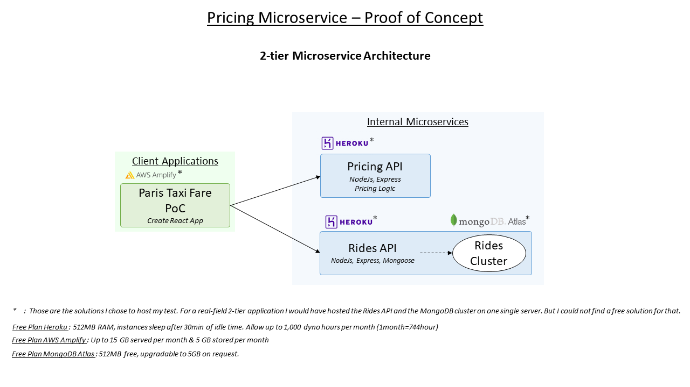
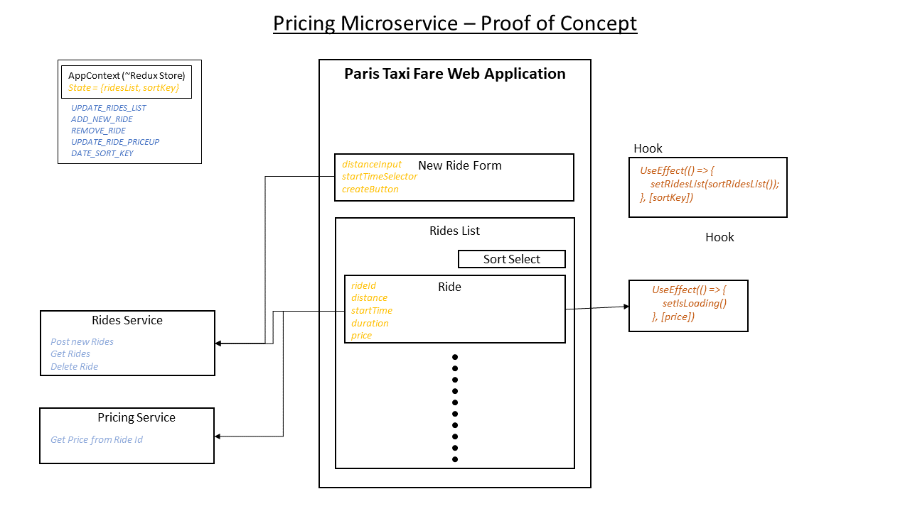
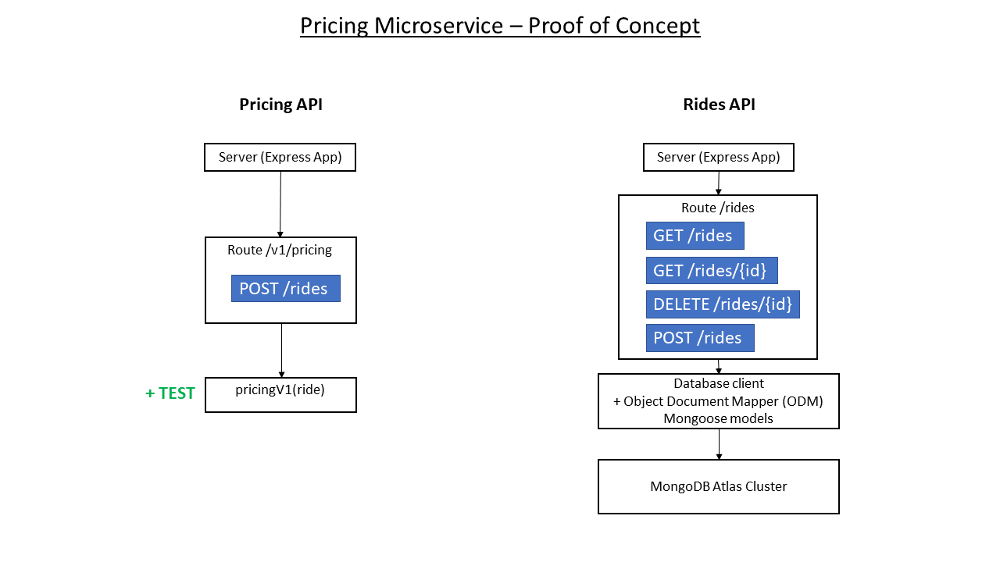

# Paris Taxi Fare - Frontend application

This react app demonstrates how microservices can be used to test and deploy new data services continuously.
Here we present a new pricing service that serves  of a taxi ride.

## Demo 
available online : https://release.dgf5qv4kzkl2i.amplifyapp.com/

**Precision:**  
*A genuine 2-tier architecture would have consisted in integrating the Rides API into the client application. I chose to diverge a little from a pure 2-tier architecture for 2 reasons :*
- Security : I wanted to deploy the architecture, and wanted to restrict the network access to the database. (plot-twist : getting a fixed IP on Heroku requires to pay...)
- Skills demonstration : Demonstrate practical application of a node server structured as a -simple- REST API.

The 3 Github Repositories are public :
- [Client App ReactJs TypeScript](https://github.com/Ludo171/paris-taxi-fare-frontend)
- [Data Service NodeJs Express Mongoose](https://github.com/Ludo171/paris-taxi-fare-rides)
- [Pricing Service NodeJs Express](https://github.com/Ludo171/paris-taxi-fare-pricing)

# CICD
Simple CICD by using a github action file. Whenever a commit is pushed on master, if the CI pipeline succeeds, it automatically merges `master` into `release`.
The `release` branch is automatically deployed on an AWS Amplify instance https://release.dgf5qv4kzkl2i.amplifyapp.com/.

# Install & Run locally
1. clone the repository
2. `npm install`
3. `npm start`
